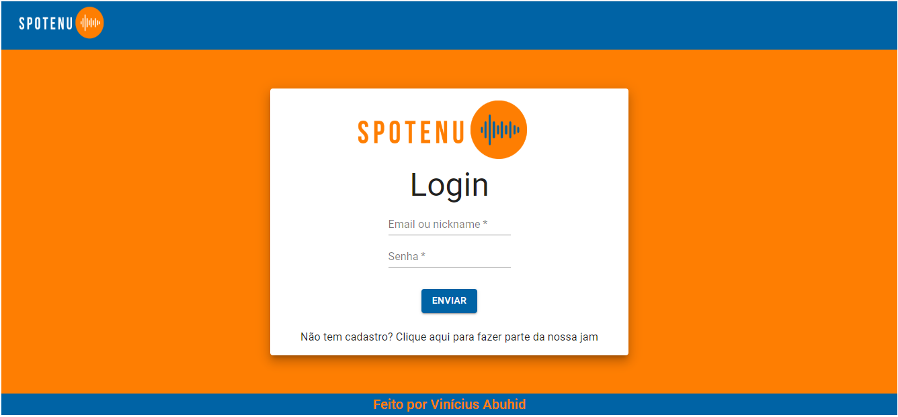
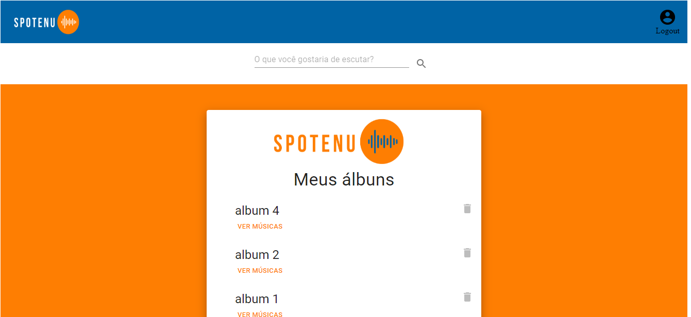
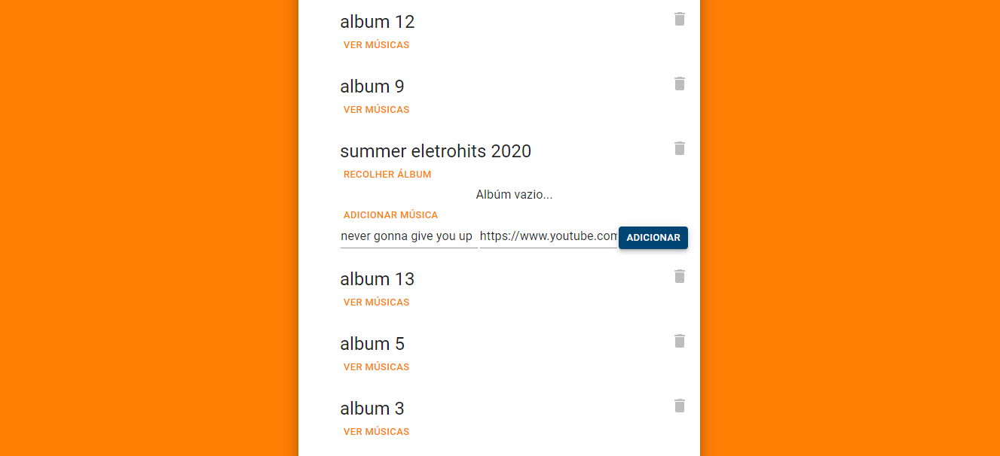
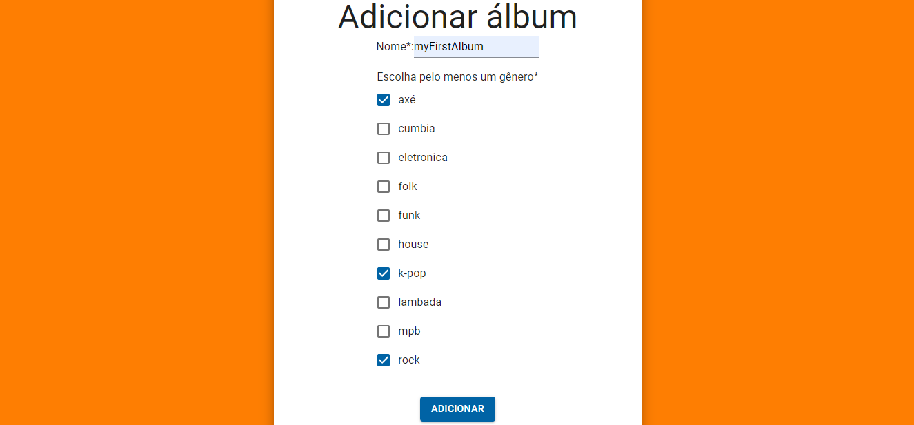
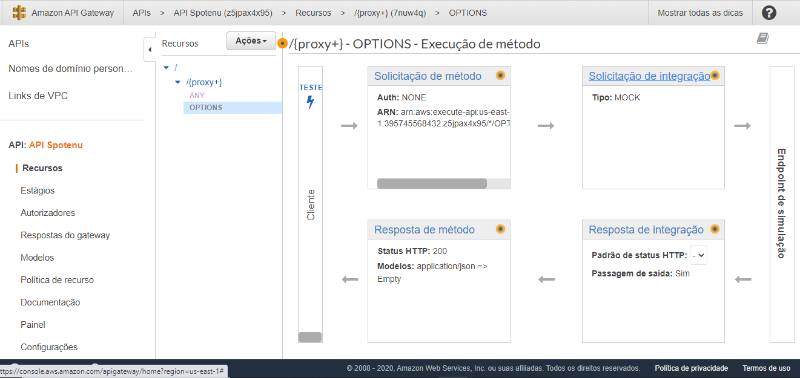
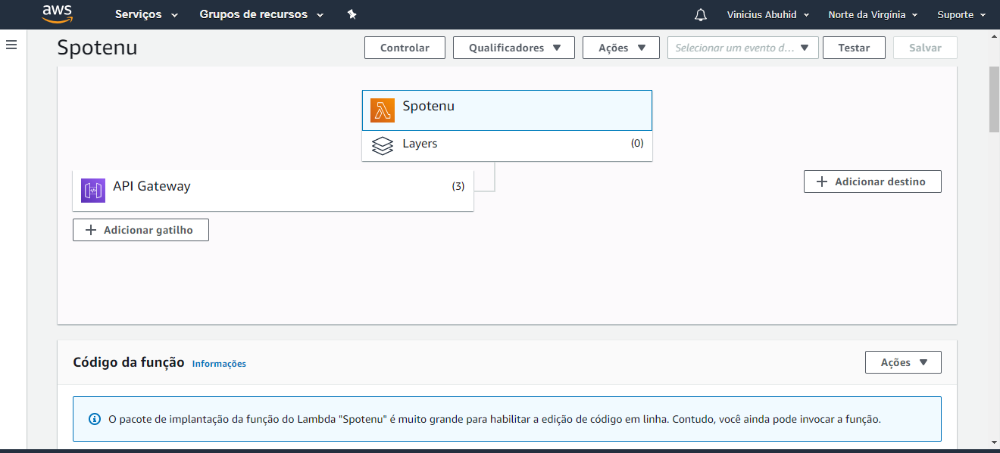
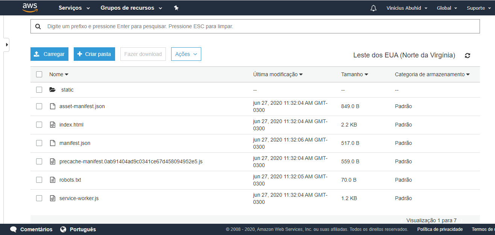

Curso Web Full Stack - 13/01/2020 a 17/07/20020

<h1 align="center">
Projeto Final: Spotenu
</h1>

</img>

O Spotenu é um projeto que visa facilitar o acesso a músicas pelo mundo. Bandas e usuários ouvintes podem se cadastrar e compartilhar suas paixões 

  

Site do projeto: em manutenção

</img>
 
</img>
</img>
</img>
</img>
</img>
</img>

## Ferramentas :wrench:
Principais ferramentas utilizadas na construção da aplicação

- **React Js** — Biblioteca Javascript para construir interfaces
- **Node Js** — Plataforma para construir aplicações web escaláveis
- **Axios** - Biblioteca para fazer XMLHttpRequests do navegador
- **Redux** — Biblioteca JavaScript de código aberto para gerenciar o estado do aplicativo
- **Node Js** — Plataforma para construir aplicações web escaláveis
- **Typescript** - TypeScript é um superconjunto de JavaScript que adiciona linguagem a linguagem
- **Express** - Framework para Node.js que permite à aplicação lidar com multiplas e diferentes requisições http à uma URL específica
- **Knex** - Construtor de SQL querys para Node.js, que dentre outras funciolnalidades, propicia a criação de pool de conexao e propagação
- **AWS Lambda** - Serviço serverless da AWS
- **AWS API Gateway** - Gerenciador de APIs da Amazon

## Escopo do projeto :pushpin:
Esse projeto foi um dos primeiros que você implementou, trata-se do Spotenu. A diferença é que agora vocês terão que implementar o frontend (usando React e Redux), o backend (Typescript, MVC e Clean Code) e toda a infraestrutura (AWS ou Firebase) que você precisar! Abaixo, colocamos as especificações divididas nessas três áreas. 

**BACKEND**

**1. Signup de usuário ouvinte**

Um usuário ouvinte tem que fornecer o nome, o email, o nickname uma senha. Faça as validações básicas e garanta que a senha tenha, no mínimo, 6 caracteres. **Em todos os cadastros e logins**, vamos usar somente o *access token*

**2. Cadastro de administrador**

Os administradores também se cadastram com nome, email, nickname e senha. Aqui, a senha tem qupossuir, no mínimo, 10 carácteres. Somente um usuário administrador pode adicionar outro (ou sejaesse endpoint deve ser autenticado e verificar se o token é de um administrador)

- **3. Signup de bandas**

A banda precisa informar o seu nome, o nickname, o email, a sua descrição e uma senha, com, no mínim6 caracteres. Uma banda deve começar com o status de não aprovada (ou seja, não retorne um *accestoken* nesse endpoint)

- **4. Ver todas as bandas**

Esse endpoint deve retornar uma lista com todas as bandas registradas no banco, com as informaçõesnome, email,  nickname e um booleano indicando se está aprovado ou não. Somente administradores podeter acesso a essa funcionalidade

- **5. Aprovação de bandas**

Um administrador pode aprovar uma banda, para que ela, então, consiga se logar. Caso um administradortente aprovar uma banda que já tinha sido aprovada, um erro deve ser retornado (e, obviamente, se abanda não existir também).

- **6. Login**

Todos os usuários (ouvintes, administradores ou bandas) devem se logar pelo mesmo endpoint. Eles podem fornecer o email ou o nickname e a senha correta. 

- **7. Adicionar Gênero**

Somente um administrador pode adicionar gêneros na nossa aplicação. Para isso, deve fornecer um nome.Caso já exista um gênero com esse nome, um erro deve ser retornado

- **8. Ver gêneros músicias**

Tanto um administrador como um usuário banda podem ver todos os gêneros músicas. Retorne uma lista com id e nome

- **9. Criação de álbuns**

Uma banda pode criar um álbum para colocar as suas músicas. Deve fornecer o nome e uma lista de gêneros. Quando o álbum for criado, ele deve ser diretamente atrelado à banda que estiver autenticada na aplicação. Só bandas podem criar álbuns.

- **10. Criação de músicas**

Para criar uma música, um nome e um álbum devem ser informados. Caso o álbum não exista, um erro deve ser informado. Se já existir uma música com esse nome no álbum, outro erro deve ser retornado. 

**INFRAESTRUTURA**

A ideia é que você utilize os serviços da AWS e do Firebase que ensinamos nessas semanas. Você pode se aventurar entre outros serviços desses *Cloud.* Além disso, você pode usar os dois juntos se quiser, por exemplo: subir o backend em *Firebase Functions* mas usar o Bucket do S3 para armazenar as mídias.

**Instruções para AWS**

1. Suba o banco de dados MySQL em uma instância da EC2
2. Crie lambdas e URLs no *API Gateway* para cada um dos endpoints solicitados e faça os testes necessários
3. Configure o *bucket* do S3 para os fluxos relacionados a imagens (ou músicas) ou para deploy do *Frontend* do seu projeto

**Instruções para Firebase**

1. Configure o *Firebase Realtime Database* ou o *Firebase Firestore* para a sua aplicação
2. Faça as configurações do serviço de *Storage* para armazenar os vídeos e as fotos
3. Suba os endpoints em *Firebase Cloud Functions* e faça os testes necessários
4. Utilize o *Firebase Hosting* ****para deploy do *Frontend* do seu projeto

**FRONTEND**
- **1. Tela de cadastro de usuário ouvinte**

Um usuário ouvinte tem que fornecer o nome, o email, o nickname uma senha para se cadastrar

- **2. Tela de cadastro de usuários administradores**

Os administradores também se cadastram com nome, email, nickname e senha. Aqui, a senha tem que possuir, no mínimo, 10 carácteres. Somente um usuário administrador pode adicionar outro (ou seja, algum usuário admin deve estar logado para fazer essa funcionalidade

- **3. Tela de cadastro de usuários bandas**

A banda precisa informar o seu nome, o nickname, o email, a sua descrição e uma senha, com, no mínimo 6 caracteres. 

- **4. Tela de aprovação de bandas**

Deve possuir uma lista com todas as bandas e um botão que permita aprovar cada uma delas

- **5. Tela de Login**

Todos os usuários (ouvintes, administradores ou bandas) devem se logar pelo mesma tela. Eles podem fornecer o email ou o nickname e a senha correta. 

- **6. Tela de home**

A tela de home pode ser acessada por todos os usuários. Ela deve possuir um menu que permita navegar pelas funcionalidades de cada um deles. 
Por exemplo, para o usuário administrador, deve haver as possibilidades de: aprovar bandas, gerenciar gêneros musicais e adicionar administradores

- **7. Tela de ver e adicionar gêneos**

Um administrador deve ser capaz de ver todos os gêneros musicais e adicionar quantos gêneros quiser passando as informações básica (no caso, só o nome).

- **8. Tela de criação de álbuns**

Essa funcionalidade é para banda criarem álbuns próprios. Para isso, ela deve passar um nome e selecionar os gêneros apropriados. 

- **9. Tela de criação de músicas**

Aqui é o onde as bandas criam músicas Para isso, devem fornecer o nome e o selecionar um álbum que já tenham criado.

## Licença :page_with_curl:

Desenvolvido por [Vinícius Abuhid](https://github.com/ViniciusAbuhid), sob a licençaX11, MIT - [Clique aqui](https://opensource.org/licenses/MIT) para mais detelhes.
